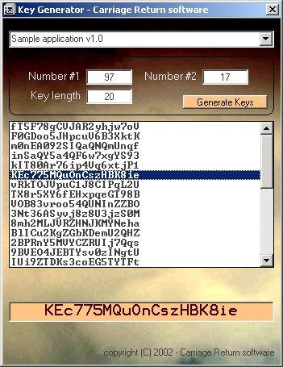



## Registration Key Generator and Verificator

### Description

This Registration Key generator will do just what the name says: generate Keys based on details you give and allow your applications to verify them (less than 10 lines of code for the verification)

You can keep details of multiple applications and their Key caracteristics. Any comment is welcome!
 
### More Info
 

             |
---                |---
**Submitted On**   |2002-04-16 17:49:02
**By**             |[Chris Gillent](https://github.com/Planet-Source-Code/PSCIndex/blob/master/ByAuthor/chris-gillent.md)
**Level**          |Intermediate
**User Rating**    |5.0 (30 globes from 6 users)
**Compatibility**  |VB 5\.0, VB 6\.0
**Category**       |[Miscellaneous](https://github.com/Planet-Source-Code/PSCIndex/blob/master/ByCategory/miscellaneous__1-1.md)
**World**          |[Visual Basic](https://github.com/Planet-Source-Code/PSCIndex/blob/master/ByWorld/visual-basic.md)
**Archive File**   |[Registrati726074162002\.zip](https://github.com/Planet-Source-Code/chris-gillent-registration-key-generator-and-verificator__1-33859/archive/master.zip)

